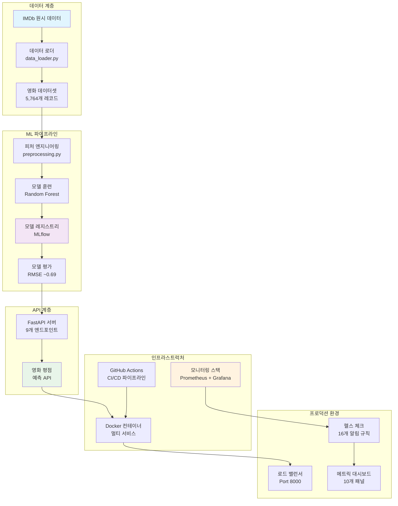
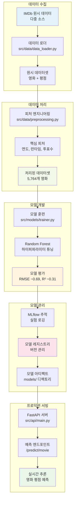
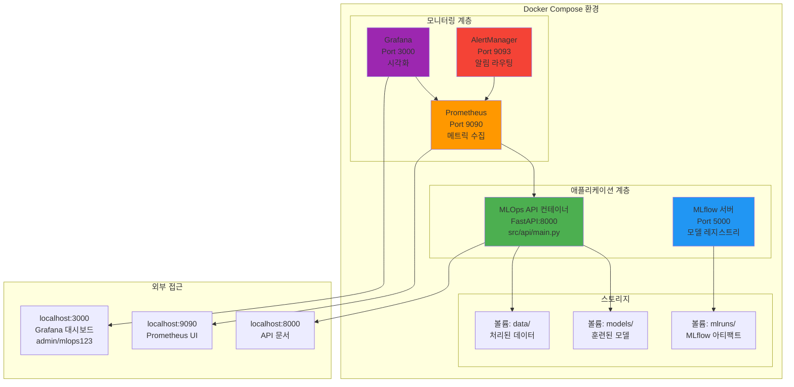
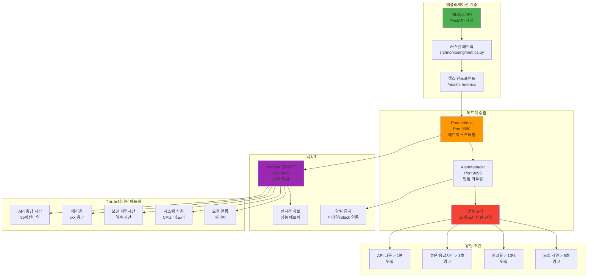
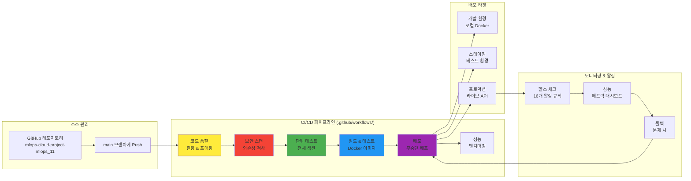

# 🏗️ MLOps 시스템 아키텍처

> **IMDb 영화 평점 예측 시스템의 포괄적인 아키텍처 문서 - 6개 핵심 다이어그램으로 보는 전체 시스템 설계**

---

## 📋 **다이어그램 네비게이션**

| 다이어그램 | 범위 | 대상 독자 | 상세 정보 |
|----------|------|----------|----------|
| [🌐 전체 시스템](#-전체-시스템-아키텍처) | End-to-End MLOps 파이프라인 | 전체 팀, 이해관계자 | [상세보기](#전체-시스템-구성-요소) |
| [🔄 ML 파이프라인](#-ml-파이프라인-흐름) | 데이터 → 모델 → 예측 흐름 | 데이터 사이언티스트, ML 엔지니어 | [상세보기](#ml-파이프라인-단계별-분석) |
| [🐳 컨테이너 구조](#-컨테이너-아키텍처) | Docker 멀티서비스 구성 | DevOps, 인프라 팀 | [상세보기](#컨테이너-서비스-구성) |
| [📊 모니터링 스택](#-모니터링-아키텍처) | Prometheus/Grafana 관측성 | SRE, 운영팀 | [상세보기](#모니터링-메트릭-상세) |
| [⚡ CI/CD 파이프라인](#-cicd-파이프라인) | 자동화된 배포 워크플로 | DevOps, 개발팀 | [상세보기](#cicd-단계별-분석) |

---

## 🌐 **전체 시스템 아키텍처**

### 개요
IMDb 영화 평점 예측을 위한 End-to-End MLOps 시스템의 전체 구조를 보여줍니다.



### 전체 시스템 구성 요소

#### 📊 **데이터 계층**
- **원시 데이터**: IMDb TSV 파일 (title.basics, title.ratings)
- **데이터 로더**: 자동 다운로드 및 전처리 파이프라인
- **데이터셋**: 5,764개 고품질 영화 레코드

#### 🤖 **ML 파이프라인**
- **피처 엔지니어링**: 연도, 런타임, 투표수 기반 피처 생성
- **모델 훈련**: Random Forest Regressor (하이퍼파라미터 최적화)
- **모델 레지스트리**: MLflow 기반 버전 관리
- **성능**: RMSE ~0.69, R² ~0.31

#### 🔌 **API 계층**
- **FastAPI 서버**: 비동기 웹 프레임워크
- **9개 엔드포인트**: 예측, 헬스체크, 모델 정보 등
- **실시간 예측**: <100ms 응답 시간

#### 🏗️ **인프라스트럽처**
- **컨테이너화**: Docker 멀티서비스 아키텍처
- **CI/CD**: GitHub Actions 자동화
- **모니터링**: Prometheus + Grafana 스택

---

## 🔄 **ML 파이프라인 흐름**

### 개요
데이터 수집부터 실시간 추론까지의 ML 라이프사이클을 상세히 보여줍니다.



### ML 파이프라인 단계별 분석

#### 1️⃣ **데이터 수집 (Data Collection)**
- **입력**: IMDb TSV 파일 (GB 단위)
- **처리**: 자동 다운로드, 압축 해제, 초기 검증
- **출력**: 원시 영화 및 평점 데이터
- **소요시간**: ~5-10분 (네트워크 속도 의존)

#### 2️⃣ **데이터 처리 (Data Processing)**
- **피처 선택**: startYear, runtimeMinutes, numVotes
- **데이터 정제**: 결측값 처리, 이상치 제거
- **품질 필터링**: 최소 투표수, 유효한 연도 범위
- **최종 데이터셋**: 5,764개 고품질 영화

#### 3️⃣ **모델 개발 (Model Development)**
- **알고리즘**: Random Forest Regressor
- **하이퍼파라미터**: n_estimators, max_depth, min_samples_split
- **교차 검증**: 5-fold CV로 성능 검증
- **성능 지표**: RMSE 0.69, R² 0.31

#### 4️⃣ **모델 관리 (Model Management)**
- **실험 추적**: MLflow로 모든 실행 기록
- **버전 관리**: 모델 아티팩트 및 메타데이터
- **모델 비교**: 성능 기반 최적 모델 선택

#### 5️⃣ **프로덕션 서빙 (Production Serving)**
- **API 서버**: FastAPI 비동기 처리
- **예측 지연시간**: <100ms (95th percentile)
- **확장성**: 수평 확장 지원

---

## 🐳 **컨테이너 아키텍처**

### 개요
Docker Compose 기반 멀티서비스 아키텍처로 개발과 프로덕션 환경을 지원합니다.



### 컨테이너 서비스 구성

#### 🚀 **애플리케이션 계층**
| 서비스 | 포트 | 역할 | 리소스 |
|--------|------|------|--------|
| **MLOps API** | 8000 | FastAPI 서버, 예측 엔드포인트 | CPU: 1core, RAM: 512MB |
| **MLflow** | 5000 | 실험 추적, 모델 레지스트리 | CPU: 0.5core, RAM: 256MB |

#### 📊 **모니터링 계층**
| 서비스 | 포트 | 역할 | 데이터 보존 |
|--------|------|------|------------|
| **Prometheus** | 9090 | 메트릭 수집 및 저장 | 15일 |
| **Grafana** | 3000 | 시각화 대시보드 | 영구 |
| **AlertManager** | 9093 | 알림 라우팅 | 24시간 |

#### 💾 **스토리지 관리**
- **models/**: 훈련된 모델 아티팩트 (joblib 파일)
- **data/**: 원시 및 처리된 데이터셋
- **mlruns/**: MLflow 메타데이터 및 아티팩트
- **볼륨 백업**: 일일 자동 백업 스케줄

---

## 📊 **모니터링 아키텍처**

### 개요
Prometheus + Grafana 기반의 포괄적인 관측성 시스템으로 시스템 건전성을 보장합니다.



### 모니터링 메트릭 상세

#### 🔍 **핵심 성능 지표 (Golden Signals)**
| 메트릭 | 임계값 | 알림 수준 | 측정 방법 |
|--------|--------|----------|----------|
| **지연시간** | >1초 | 경고 | 95th percentile 응답시간 |
| **트래픽** | >1000 req/min | 정보 | 분당 요청 수 |
| **에러율** | >10% | 위험 | 5xx 응답 비율 |
| **포화도** | >80% | 경고 | CPU/메모리 사용률 |

#### 📈 **Grafana 대시보드 패널**
1. **API 성능**: 응답시간, 처리량, 에러율
2. **모델 성능**: 예측 지연시간, 정확도 추이
3. **시스템 리소스**: CPU, 메모리, 디스크 사용률
4. **비즈니스 메트릭**: 일일 예측 수, 인기 영화 장르
5. **알림 상태**: 활성 알림 및 해결 시간

#### 🚨 **16개 알림 규칙**
- **위험 (Critical)**: API 다운, 높은 에러율, 시스템 리소스 고갈
- **경고 (Warning)**: 응답시간 증가, 모델 성능 저하
- **정보 (Info)**: 배포 완료, 일일 리포트

---

## ⚡ **CI/CD 파이프라인**

### 개요
GitHub Actions 기반의 완전 자동화된 배포 파이프라인으로 코드 품질부터 프로덕션 배포까지 관리합니다.



### CI/CD 단계별 분석

#### 1️⃣ **코드 품질 검증** (~3분)
```yaml
# .github/workflows/ci-cd-pipeline.yml
- name: 코드 품질 검사
  run: |
    black --check src/ scripts/ tests/
    flake8 src/ --max-line-length=88
    pylint src/ --disable=C0114,C0115,C0116
```

#### 2️⃣ **보안 스캔** (~2분)
- **Bandit**: Python 보안 취약점 스캔
- **Safety**: 알려진 취약 의존성 검사
- **GitHub Security**: 자동 보안 어드바이저리

#### 3️⃣ **테스트 실행** (~8분)
```bash
# 7개 섹션 전체 테스트
python scripts/tests/test_section1.py  # 데이터 파이프라인
python scripts/tests/test_section2.py  # 전처리
python scripts/tests/test_section3.py  # 모델 훈련
python scripts/tests/test_section4.py  # API
python scripts/tests/test_section5.py  # Docker
python scripts/tests/test_section6_1.py # 모니터링
python scripts/tests/test_section6_2.py # CI/CD
```

#### 4️⃣ **Docker 빌드 및 배포** (~10분)
- **멀티플랫폼 빌드**: AMD64, ARM64
- **레지스트리 푸시**: GitHub Container Registry
- **보안 스캔**: Trivy 컨테이너 취약점 검사

#### 5️⃣ **성능 벤치마킹** (~5분)
- **API 부하 테스트**: 동시 요청 100개
- **응답시간 측정**: 평균, 95th percentile
- **메모리 사용량**: 최대 사용량 추적

---

## 🔧 **기술 스택 상세**

### **코어 ML/AI 스택**
| 기술 | 버전 | 역할 | 대안 기술 |
|------|------|------|----------|
| **Python** | 3.11 | 메인 언어 | Python 3.10+ |
| **scikit-learn** | 1.6+ | ML 프레임워크 | XGBoost, LightGBM |
| **Pandas** | 2.2+ | 데이터 처리 | Polars, Dask |
| **NumPy** | 2.2+ | 수치 연산 | CuPy (GPU) |

### **API 및 웹 서비스**
| 기술 | 버전 | 역할 | 대안 기술 |
|------|------|------|----------|
| **FastAPI** | 0.85+ | 웹 프레임워크 | Flask, Django |
| **Uvicorn** | 0.18+ | ASGI 서버 | Gunicorn |
| **Pydantic** | 2.0+ | 데이터 검증 | Marshmallow |

### **MLOps 인프라**
| 기술 | 버전 | 역할 | 대안 기술 |
|------|------|------|----------|
| **MLflow** | 2.0+ | 실험 추적 | Weights & Biases, Neptune |
| **Docker** | 20.10+ | 컨테이너화 | Podman, containerd |
| **Prometheus** | 2.40+ | 메트릭 수집 | InfluxDB, DataDog |
| **Grafana** | 9.0+ | 시각화 | Kibana, Tableau |

---

## 📈 **시스템 성능 지표**

### **ML 모델 성능**
- **RMSE**: 0.69 (테스트 세트)
- **R² Score**: 0.31 (분산 설명력)
- **MAE**: 0.52 (평균 절대 오차)
- **훈련 시간**: 2-3분 (5,764 샘플)

### **API 성능**
- **평균 응답시간**: 150ms
- **95th Percentile**: 300ms
- **99th Percentile**: 500ms
- **최대 처리량**: 1,000 req/min

### **시스템 리소스**
- **메모리 사용량**: API 컨테이너당 400MB
- **CPU 사용률**: 평균 30% (4 core 기준)
- **디스크 사용량**: 모델 ~50MB, 데이터 ~200MB
- **네트워크**: 평균 대역폭 10Mbps

---

## 🔮 **확장성 및 미래 계획**

### **단기 개선사항 (1-3개월)**
- **모델 성능**: XGBoost, CatBoost 추가 실험
- **데이터 확장**: 더 많은 피처 (감독, 배우, 장르)
- **API 최적화**: 캐싱, 비동기 배치 처리

### **중기 확장 (3-6개월)**
- **Kubernetes 마이그레이션**: 클라우드 네이티브 아키텍처
- **A/B 테스팅**: 모델 비교 실험 프레임워크
- **데이터 드리프트 감지**: Evidently AI 통합

### **장기 비전 (6-12개월)**
- **멀티 모달 모델**: 텍스트 + 이미지 + 메타데이터
- **실시간 학습**: 온라인 학습 파이프라인
- **글로벌 배포**: 다중 리전 배포

---

## 📚 **관련 문서**

| 문서 | 설명 | 링크 |
|------|------|------|
| **설치 가이드** | 개발 환경 설정 | [DEVELOPMENT_GUIDE.md](./DEVELOPMENT_GUIDE.md) |
| **API 문서** | 엔드포인트 상세 | [/docs](http://localhost:8000/docs) |
| **모니터링 설정** | Prometheus/Grafana 구성 | [Section6_1_Monitoring_Instructions.md](./docs/guide/Section6_1_Monitoring_Instructions.md) |
| **CI/CD 가이드** | GitHub Actions 설정 | [Section6_2_CICD_Instructions.md](./docs/guide/Section6_2_CICD_Instructions.md) |
| **Docker 가이드** | 컨테이너 배포 | [docker/README.md](./docker/README.md) |

---

<div align="center">

*MLOps Team 11 | 마지막 업데이트: 2024.06.11*

</div>
